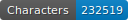
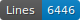

# FoNDUE - FR - MSS - 18

   

This repo contains the transcription of 18th c. French manuscripts.

## Content

| Town          | Library                     | Shelfmark  | Folios   | Date             | Transcription         |
|---------------|-----------------------------|------------|----------|------------------|-----------------------|
| Aschaffenburg | Hofbibliothek Aschaffenburg | 48         | 82       | 1st half 18th c. | P. Nahon and S. Gabay |
| Paris         | Paris, Bnf, Arsenal         | [10283](https://gallica.bnf.fr/ark:/12148/btv1b10724224z/f1.item)      | 23       | 1725-29          | Y. Jauregui           |
| Paris         | Paris, Bnf, Arsenal         | [10285](https://gallica.bnf.fr/ark:/12148/btv1b107241397/f1.item)      | 10       | 1731             | Y. Jauregui           |
| Paris         | Paris, Bnf, Arsenal         | [10289](https://gallica.bnf.fr/ark:/12148/btv1b107242563/f1.item)      | 25       | 1744             | Y. Jauregui           |
| Paris         | Paris, Bnf, Arsenal         | [10292](https://gallica.bnf.fr/ark:/12148/btv1b107241145/f1.item)      | 13       | 1746             | Y. Jauregui           |
| Genève        | Genève, AEG                 | [211](https://ge.ch/arvaegconsult/ws/consaeg/public/fiche/Record?r=1&rpp=-1&upp=0&w=NATIVE%28%27ORIGINE+%3D+%27%27DOC%27%27+AND+REFDOC+%3D+%27%27RC%2F%27%27*+AND+NIVCONS+%3D+2%27%29&m=218&order=native%28%27CDOCA%2CNUMOR%27%29&type=DOC&action=-1)      | 10       | 1712             | M. Cicchini           |

## How to cite

Cf. [`htr-united.yml`](https://github.com/FoNDUE-HTR/FONDUE-FR-MSS-18/blob/main/htr-united.yml) file.

## Licences
Annotation is CC-BY. Images belong to the digital libraries.

 