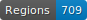
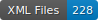

# FoNDUE - FR - MSS - 18

   

This repo contains the transcription of 18th c. French manuscripts.

## Content

| Town          | Library                     | Shelfmark  | Folios   | Date             | Transcription         |
|---------------|-----------------------------|------------|----------|------------------|-----------------------|
| Aschaffenburg | Hofbibliothek Aschaffenburg | 48         | samples  | 1st half 18th c. | P. Nahon and S. Gabay |

## How to cite

Cf. [`htr-united.yml`](https://github.com/FoNDUE-HTR/FONDUE-FR-MSS-18/blob/main/htr-united.yml) file.

## Licences
Annotation is CC-BY. Images belong to the digital libraries.

 